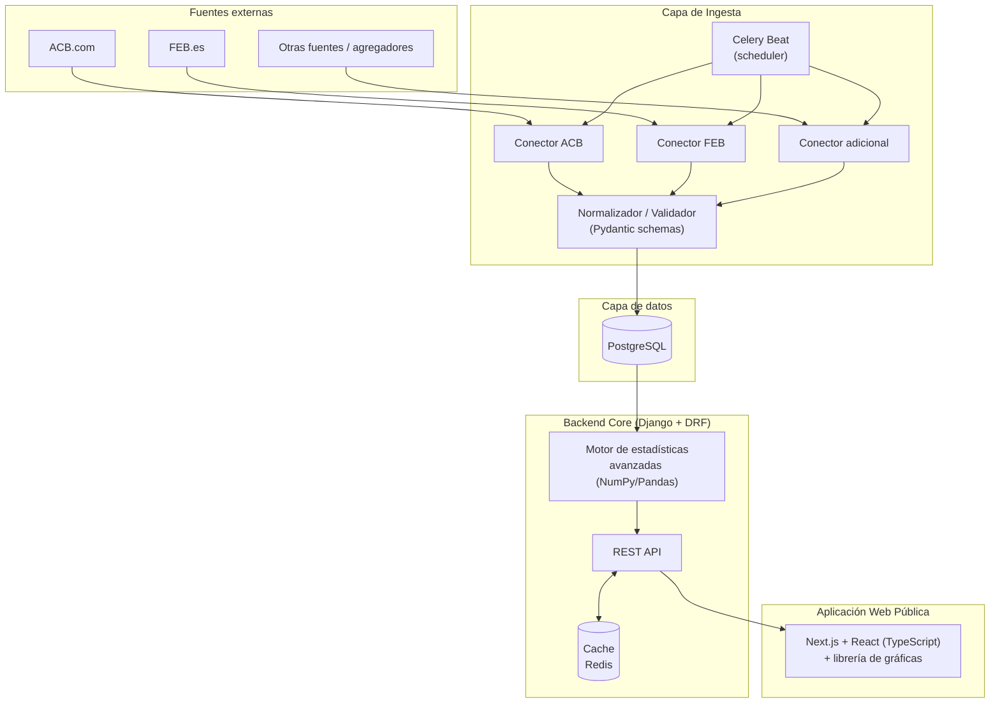
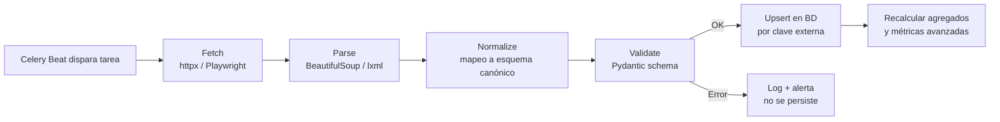
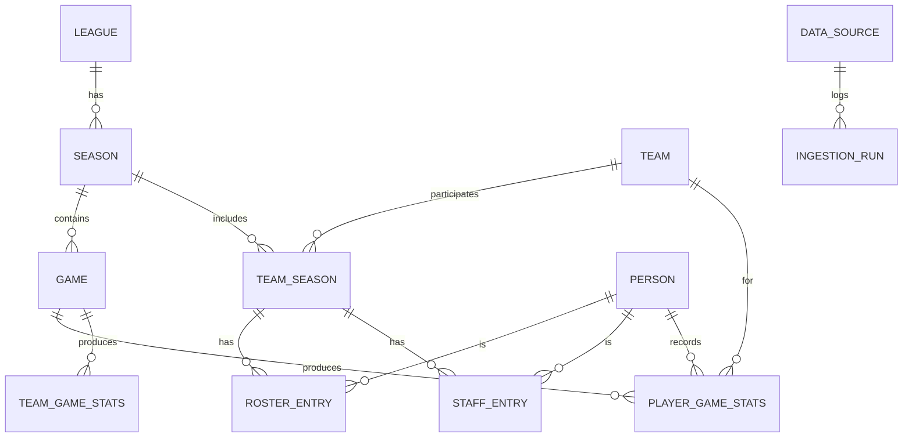

# Especificación Técnica
## Plataforma de Estadísticas de Baloncesto — ACB / LEB Oro / LEB Plata

**Versión:** 0.3 (decisiones de §12 confirmadas)
**Fecha:** Junio 2026
**Tipo de proyecto:** Aplicación web pública, abierta y no comercial, orientada a aficionados al baloncesto

---

### Premisas de partida (confirmadas)

| Decisión | Valor confirmado |
|---|---|
| Stack backend | **Python / Django** (Django REST Framework para la API) |
| Stack frontend | **TypeScript** (Next.js / React) |
| Competiciones cubiertas (fase inicial) | ACB + LEB Oro (Primera FEB) + LEB Plata (Segunda FEB) |
| Propósito | Visualización estadística para público general, proyecto abierto y no comercial |
| Foco | Análisis estadístico histórico de equipos, jugadores y staff técnico (no datos en vivo) |
| Licencia | **MIT** (código abierto) |
| Profundidad histórica | Backfill de **5-10 temporadas pasadas** por liga, además de la temporada actual |
| Repositorio | **Monorepo** (backend Django + frontend Next.js) |
| Entorno de desarrollo local | **Docker Compose** (Postgres + Redis + backend + worker + frontend) |
| Equipo de desarrollo | **Desarrollo en solitario** |

> **Nota de versión:** se sustituye el backend de Node.js/NestJS por **Python/Django**, manteniendo TypeScript en el frontend. Python ofrece un ecosistema más maduro y fiable para el cálculo estadístico (NumPy, Pandas, scikit-learn) y el procesamiento de datos, lo que reduce el riesgo de bugs en cálculos numéricos sensibles (métricas avanzadas, agregaciones).

---

## Índice

1. [Objetivos y alcance](#1-objetivos-y-alcance)
2. [Arquitectura general del sistema](#2-arquitectura-general-del-sistema)
3. [Capa de conectores e ingesta de datos](#3-capa-de-conectores-e-ingesta-de-datos)
4. [Modelo de datos](#4-modelo-de-datos)
5. [API y capa de servicios](#5-api-y-capa-de-servicios)
6. [Frontend e interfaz de usuario](#6-frontend-e-interfaz-de-usuario)
7. [Stack tecnológico recomendado](#7-stack-tecnológico-recomendado)
8. [Infraestructura, despliegue y costes](#8-infraestructura-despliegue-y-costes)
9. [Requisitos no funcionales](#9-requisitos-no-funcionales)
10. [Aspectos legales y de cumplimiento](#10-aspectos-legales-y-de-cumplimiento)
11. [Roadmap por fases](#11-roadmap-por-fases)
12. [Decisiones confirmadas y riesgos a vigilar](#12-decisiones-confirmadas-y-riesgos-a-vigilar)
13. [Próximos pasos sugeridos](#13-próximos-pasos-sugeridos)

---

## 1. Objetivos y alcance

### 1.1 Objetivo del proyecto

Construir una plataforma web pública que **recopile, normalice y presente** estadísticas históricas (no en vivo) de jugadores, equipos y staff técnico de ACB, LEB Oro y LEB Plata, con foco en:

- Hacer accesible al público general estadísticas avanzadas que normalmente solo manejan analistas/scouts.
- Permitir comparativas entre jugadores y equipos a lo largo de temporadas.
- Generar visualizaciones claras (gráficas) que faciliten la interpretación de los datos.

### 1.2 Alcance funcional (in-scope)

- Conectores automatizados de recogida de datos desde fuentes web externas (oficiales y/o agregadores).
- Pipeline de normalización, validación y almacenamiento histórico de datos.
- Modelo de datos relacional para jugadores, equipos, staff técnico, partidos y estadísticas.
- Cálculo de métricas avanzadas derivadas (no solo las que publica la fuente original).
- API pública de consulta de estadísticas.
- Interfaz web de visualización: perfiles de jugador/equipo, comparativas, rankings, tendencias por temporada.
- Cobertura inicial: ACB, LEB Oro, LEB Plata, incluyendo **temporada actual y backfill de 5-10 temporadas pasadas** por liga (ejecutado de forma incremental según roadmap — ver §11).

### 1.3 Fuera de alcance (explícitamente)

- **Datos en vivo / live-scoring** (marcador en tiempo real, play-by-play durante el partido). El sistema trabaja con datos **post-partido**, ingeridos en batch.
- Retransmisión de vídeo, audio o contenido multimedia con derechos de terceros.
- Apuestas, pronósticos o cualquier funcionalidad relacionada con juego/apuestas.
- Fase inicial: ligas femeninas, categorías inferiores (EBA, junior) — **no entran en el MVP, pero quedan planificadas en el roadmap futuro** (Fase 4, ver §11 y §12).

---

## 2. Arquitectura general del sistema

### 2.1 Visión de alto nivel



### 2.2 Componentes principales

| Componente | Responsabilidad | Notas |
|---|---|---|
| **Conectores (Connectors)** | Obtener datos crudos de cada fuente externa | Un conector por fuente, patrón *Adapter*, implementado como módulo Python |
| **Scheduler / Job Queue** | Disparar la ingesta de forma periódica (no en vivo) | **Celery Beat** programa tareas (cron diario o post-jornada), **Celery** las ejecuta de forma asíncrona |
| **Normalizador / Validador** | Transformar datos crudos heterogéneos al modelo canónico | Valida con esquemas **Pydantic** estrictos antes de persistir |
| **Base de datos** | Almacenamiento histórico fuente de verdad | PostgreSQL relacional, accedida vía Django ORM |
| **Motor de estadísticas avanzadas** | Calcular métricas derivadas (PER, TS%, eFG%, Usage Rate, etc.) | Módulo Python nativo del backend (NumPy/Pandas), se ejecuta sobre datos ya normalizados |
| **API** | Exponer datos al frontend (y potencialmente a terceros) | **Django REST Framework**, versionada y cacheada |
| **Frontend público** | Visualización: perfiles, comparativas, gráficas | Next.js + React + TypeScript (SSR/SSG) por rendimiento y SEO |
| **Capa de caché** | Reducir carga en BD para consultas agregadas frecuentes | Redis, compartido como broker de Celery y caché de Django |

La arquitectura se plantea como **monolito modular** (no microservicios): un único backend **Django** organizado en *apps* (`connectors`, `ingestion`, `stats`, `players`, `teams`, `games`, `api`) es más fácil de mantener y desplegar con recursos limitados que una arquitectura distribuida. El procesamiento de ingesta queda desacoplado del proceso web gracias a **Celery**, que se ejecuta como *worker* independiente, sin necesidad de separar el backend en microservicios.

El **frontend** se mantiene como una aplicación TypeScript independiente (Next.js), consumiendo la API REST de Django — es decir, **frontend y backend se despliegan como dos servicios separados** comunicados por HTTP/JSON (ver §6.4).

---

## 3. Capa de conectores e ingesta de datos

### 3.1 Fuentes de datos candidatas

| Fuente | Tipo | Cobertura potencial | Comentario |
|---|---|---|---|
| ACB.com | Web oficial | Liga ACB: equipos, jugadores, partidos, estadísticas por partido | Fuente primaria para ACB |
| FEB.es / competiciones FEB | Web oficial | LEB Oro (Primera FEB), LEB Plata (Segunda FEB) | Fuente primaria para LEB. Ejemplo de endpoint de estadísticas: `https://www.feb.es/primerafeb/estadisticas.aspx` |
| Agregadores estadísticos (ej. RealGM, Eurobasket, proxy de stats) | Secundaria | Datos complementarios, históricos, comparativa internacional | Útil para rellenar huecos o validar datos cruzados |

> **Decisión confirmada:** ACB.com y FEB.es son las fuentes iniciales. La cobertura podrá **ampliarse a otras fuentes en el futuro** si resulta necesario (datos faltantes, validación cruzada, nuevas competiciones).

> **Nota de nomenclatura:** desde la temporada 2024-25, la FEB renombró sus competiciones: la antigua **LEB Oro** pasó a llamarse **Primera FEB**, y la antigua **LEB Plata** pasó a llamarse **Segunda FEB**. Esto se refleja en la URL de ejemplo anterior (`/primerafeb/`). Este documento sigue usando "LEB Oro/LEB Plata" como referencia coloquial, pero los conectores deben mapear ambos nombres (histórico y actual) a la misma entidad `League` en el modelo de datos.

> **Importante:** antes de implementar cualquier conector, se debe revisar el `robots.txt` y los términos de uso de cada fuente, y diseñar la frecuencia de acceso para minimizar la carga sobre sus servidores (ver §10).

### 3.2 Patrón de conector (Adapter)

Cada fuente se implementa como un **conector independiente** que cumple una interfaz común, de modo que añadir una nueva fuente no afecta al resto del sistema.

```python
# connectors/base.py
# Common contract that every data-source connector must implement.

from abc import ABC, abstractmethod
from dataclasses import dataclass
from datetime import datetime
from typing import Any


@dataclass
class RawSourcePayload:
    """Raw payload returned by a connector before normalization.

    Each connector returns data in its own shape; normalization
    happens in a later pipeline stage.

    Attributes
    ----------
    source_id : str
        Identifier of the connector that produced this payload.
    fetched_at : datetime
        Timestamp at which the data was fetched from the source.
    data : Any
        Raw, source-specific payload (HTML, JSON, etc.).
    """

    source_id: str
    fetched_at: datetime
    data: Any


class SourceConnector(ABC):
    """Common interface every source connector must implement.

    Keeps ingestion logic decoupled from source-specific details,
    following the Adapter pattern.
    """

    #: Unique identifier for this connector, e.g. "acb", "feb-leb-oro".
    id: str

    @abstractmethod
    def fetch_teams(self, season_external_id: str) -> RawSourcePayload:
        """Fetch the list of teams for a given season.

        Parameters
        ----------
        season_external_id : str
            Identifier of the season as used by the external source.

        Returns
        -------
        RawSourcePayload
            Raw team list payload, not yet normalized.
        """
        raise NotImplementedError

    @abstractmethod
    def fetch_roster(self, team_external_id: str, season_external_id: str) -> RawSourcePayload:
        """Fetch the full roster for a given team and season.

        Parameters
        ----------
        team_external_id : str
            Identifier of the team as used by the external source.
        season_external_id : str
            Identifier of the season as used by the external source.

        Returns
        -------
        RawSourcePayload
            Raw roster payload, not yet normalized.
        """
        raise NotImplementedError

    @abstractmethod
    def fetch_completed_games(self, season_external_id: str) -> RawSourcePayload:
        """Fetch completed games for a given season (no live games).

        Parameters
        ----------
        season_external_id : str
            Identifier of the season as used by the external source.

        Returns
        -------
        RawSourcePayload
            Raw payload listing finished games only.
        """
        raise NotImplementedError

    @abstractmethod
    def fetch_box_score(self, game_external_id: str) -> RawSourcePayload:
        """Fetch the final box score for a finished game.

        Parameters
        ----------
        game_external_id : str
            Identifier of the game as used by the external source.

        Returns
        -------
        RawSourcePayload
            Raw box score payload, not yet normalized.
        """
        raise NotImplementedError
```

### 3.3 Pipeline ETL



Librerías Python recomendadas por etapa:

| Etapa | Librería | Uso |
|---|---|---|
| Fetch | `httpx` / `requests` | Peticiones HTTP a páginas estáticas o APIs JSON |
| Fetch (páginas dinámicas) | `Playwright` (bindings Python) | Páginas que renderizan contenido vía JavaScript |
| Parse | `BeautifulSoup4` / `lxml` | Extracción de datos desde HTML |
| Validate | `Pydantic` | Esquemas de validación antes de persistir en BD |
| Orquestación | `Celery` + `Celery Beat` | Tareas asíncronas programadas, reintentos automáticos |

Principios de diseño del pipeline:

- **Idempotencia:** cada entidad externa se identifica por `(source_id, external_id)`. Reingerir el mismo dato no debe duplicar registros (`update_or_create` del ORM de Django).
- **Trazabilidad:** cada ejecución de ingesta queda registrada (`IngestionRun`: inicio, fin, nº de registros, errores) para poder auditar qué conector falló y cuándo.
- **Tolerancia a cambios de la fuente:** los parsers se versionan; si una fuente cambia su HTML/estructura, el conector falla de forma controlada (no silenciosa) y genera alerta, en lugar de persistir datos corruptos.
- **No tiempo real:** la ingesta se ejecuta tras la finalización de cada jornada/partido (tarea Celery programada vía Celery Beat), nunca durante el partido. Esto reduce drásticamente la carga sobre las fuentes y simplifica el sistema (no hay que gestionar estados parciales de partido).

### 3.4 Resiliencia y mantenimiento

- **Rate limiting** configurable por conector (peticiones/segundo, *backoff* exponencial ante errores; Celery soporta reintentos con backoff de forma nativa).
- **Cache de respuestas crudas** (almacenar el HTML/JSON original durante un tiempo) para poder re-procesar sin volver a golpear la fuente si se detecta un bug en el parser.
- **Monitorización de fallos**: si un conector falla repetidamente, debe notificar (log estructurado, opcionalmente webhook/email) en lugar de fallar en silencio.

---

## 4. Modelo de datos

### 4.1 Diagrama entidad-relación (simplificado)



### 4.2 Catálogo de entidades

| Entidad | Descripción | Campos clave |
|---|---|---|
| `League` | Competición (ACB, LEB Oro, LEB Plata) | `id`, `name`, `level`, `country` |
| `Season` | Temporada de una liga | `id`, `league`, `name`, `start_date`, `end_date` |
| `Team` | Club, entidad estable en el tiempo | `id`, `name`, `short_name`, `city`, `founded_year` |
| `TeamSeason` | Participación de un equipo en una temporada concreta (puede cambiar de categoría) | `id`, `team`, `season`, `league` |
| `Person` | Entidad base para cualquier persona (jugador o staff) | `id`, `first_name`, `last_name`, `birth_date`, `nationality` |
| `RosterEntry` | Vínculo jugador–equipo–temporada | `person`, `team_season`, `jersey_number`, `position`, `height_cm`, `weight_kg` |
| `StaffEntry` | Vínculo staff técnico–equipo–temporada | `person`, `team_season`, `role` (head coach, assistant, GM, physio…) |
| `Game` | Partido finalizado | `id`, `season`, `home_team_season`, `away_team_season`, `date`, `final_score_home`, `final_score_away`, `round` |
| `PlayerGameStats` | Estadísticas de un jugador en un partido | `game`, `person`, `minutes_played`, `points`, `rebounds_*`, `assists`, `steals`, `blocks`, `turnovers`, `fouls`, tiros desglosados |
| `TeamGameStats` | Estadísticas de equipo en un partido (agregadas + posesiones estimadas) | `game`, `team_season`, totales + `pace`, `possessions` |
| `PlayerSeasonAggregate` | Vista materializada: medias/totales y métricas avanzadas por temporada | `person`, `season`, medias, `per`, `ts_percent`, `usage_rate`, `efg_percent` |
| `DataSource` | Catálogo de fuentes externas | `id`, `name`, `base_url`, `type` |
| `IngestionRun` | Auditoría de cada ejecución de un conector | `id`, `data_source`, `started_at`, `finished_at`, `status`, `records_processed`, `error_log` |

### 4.3 Modelos Django (extracto representativo)

```python
# models.py (excerpt)
# Full schema would include indexes, additional constraints and relations.

from django.db import models


class League(models.Model):
    """Basketball competition (e.g. ACB, LEB Oro, LEB Plata).

    Attributes
    ----------
    name : str
        Competition name.
    level : int
        Competition tier, 1 being the top division.
    country : str
        ISO country code, defaults to Spain.
    """

    name = models.CharField(max_length=100)
    level = models.PositiveSmallIntegerField()
    country = models.CharField(max_length=2, default="ES")


class Season(models.Model):
    """A single season of a given league.

    Attributes
    ----------
    league : League
        League this season belongs to.
    name : str
        Human-readable season label, e.g. "2025-2026".
    start_date : date
        Season start date.
    end_date : date or None
        Season end date, null while the season is ongoing.
    """

    league = models.ForeignKey(League, on_delete=models.CASCADE, related_name="seasons")
    name = models.CharField(max_length=20)
    start_date = models.DateField()
    end_date = models.DateField(null=True, blank=True)


class Team(models.Model):
    """A club entity, stable across seasons.

    Attributes
    ----------
    name : str
        Full team name.
    short_name : str
        Abbreviated name used in compact UI elements.
    city : str or None
        City where the team is based.
    founded_year : int or None
        Year the club was founded.
    """

    name = models.CharField(max_length=150)
    short_name = models.CharField(max_length=20)
    city = models.CharField(max_length=100, null=True, blank=True)
    founded_year = models.PositiveSmallIntegerField(null=True, blank=True)


class Person(models.Model):
    """Base entity for any individual: player or technical staff member.

    Attributes
    ----------
    first_name : str
        Given name.
    last_name : str
        Family name.
    birth_date : date or None
        Date of birth.
    nationality : str or None
        ISO country code of nationality.
    """

    first_name = models.CharField(max_length=100)
    last_name = models.CharField(max_length=100)
    birth_date = models.DateField(null=True, blank=True)
    nationality = models.CharField(max_length=2, null=True, blank=True)


class RosterEntry(models.Model):
    """Link between a player and a team for a given season.

    Attributes
    ----------
    person : Person
        The player.
    team_season : TeamSeason
        The team-season this roster entry belongs to.
    jersey_number : int or None
        Shirt number worn by the player.
    position : str or None
        Playing position (PG, SG, SF, PF, C).
    height_cm : int or None
        Player height in centimeters.
    weight_kg : int or None
        Player weight in kilograms.
    """

    person = models.ForeignKey(Person, on_delete=models.CASCADE, related_name="roster_entries")
    team_season = models.ForeignKey("TeamSeason", on_delete=models.CASCADE, related_name="roster_entries")
    jersey_number = models.PositiveSmallIntegerField(null=True, blank=True)
    position = models.CharField(max_length=2, null=True, blank=True)
    height_cm = models.PositiveSmallIntegerField(null=True, blank=True)
    weight_kg = models.PositiveSmallIntegerField(null=True, blank=True)


class PlayerGameStats(models.Model):
    """Box score statistics for a single player in a single game.

    Attributes
    ----------
    game : Game
        The game this stat line belongs to.
    person : Person
        The player.
    minutes_played : int
        Minutes played in the game.
    points, rebounds_off, rebounds_def, assists, steals, blocks,
    turnovers, fouls : int
        Standard box score counting statistics.
    field_goals_made, field_goals_att, three_point_made,
    three_point_att, free_throws_made, free_throws_att : int
        Shooting statistics broken down by shot type.
    """

    game = models.ForeignKey("Game", on_delete=models.CASCADE, related_name="player_stats")
    person = models.ForeignKey(Person, on_delete=models.CASCADE, related_name="game_stats")
    minutes_played = models.PositiveSmallIntegerField()
    points = models.PositiveSmallIntegerField()
    rebounds_off = models.PositiveSmallIntegerField()
    rebounds_def = models.PositiveSmallIntegerField()
    assists = models.PositiveSmallIntegerField()
    steals = models.PositiveSmallIntegerField()
    blocks = models.PositiveSmallIntegerField()
    turnovers = models.PositiveSmallIntegerField()
    fouls = models.PositiveSmallIntegerField()
    field_goals_made = models.PositiveSmallIntegerField()
    field_goals_att = models.PositiveSmallIntegerField()
    three_point_made = models.PositiveSmallIntegerField()
    three_point_att = models.PositiveSmallIntegerField()
    free_throws_made = models.PositiveSmallIntegerField()
    free_throws_att = models.PositiveSmallIntegerField()
```

### 4.4 Métricas avanzadas calculadas

El **motor de estadísticas** vive como una app Django nativa (`stats/metrics.py`), apoyada en NumPy/Pandas, y no se limita a replicar lo publicado por la fuente: calcula métricas derivadas estándar en el análisis de baloncesto, útiles para el público general una vez explicadas (ver glosario en §6.1):

| Métrica | Qué mide |
|---|---|
| **TS% (True Shooting)** | Eficiencia de tiro considerando 2P, 3P y tiros libres |
| **eFG% (Effective Field Goal)** | Eficiencia de tiro de campo ponderando el valor del triple |
| **Usage Rate** | % de jugadas de equipo "usadas" por un jugador mientras está en pista |
| **PER (Player Efficiency Rating)** | Índice compuesto de producción por minuto |
| **Pace / Posesiones estimadas** | Ritmo de juego de un equipo |
| **Net Rating ofensivo/defensivo** | Puntos anotados/recibidos por 100 posesiones |

Al estar todo el backend en Python, este módulo puede apoyarse directamente en **NumPy** para cálculo vectorizado y, en fases posteriores, en **Pandas** (agregaciones por temporada) y **scikit-learn** (similaridad entre jugadores, clustering por estilo de juego) sin necesidad de un servicio adicional:

```python
import numpy as np


def calculate_player_efficiency_rating(
    points: np.ndarray,
    rebounds: np.ndarray,
    assists: np.ndarray,
    steals: np.ndarray,
    blocks: np.ndarray,
    turnovers: np.ndarray,
    missed_field_goals: np.ndarray,
    missed_free_throws: np.ndarray,
    minutes_played: np.ndarray,
) -> np.ndarray:
    """Compute a simplified, uncorrected Player Efficiency Rating (PER).

    This is the unadjusted/uncorrected version of PER (does not apply
    league pace or position adjustments), intended as a quick relative
    indicator rather than the official Hollinger formula.

    Parameters
    ----------
    points : np.ndarray
        Total points scored per game.
    rebounds : np.ndarray
        Total rebounds (offensive + defensive) per game.
    assists : np.ndarray
        Total assists per game.
    steals : np.ndarray
        Total steals per game.
    blocks : np.ndarray
        Total blocks per game.
    turnovers : np.ndarray
        Total turnovers per game.
    missed_field_goals : np.ndarray
        Missed field goal attempts per game.
    missed_free_throws : np.ndarray
        Missed free throw attempts per game.
    minutes_played : np.ndarray
        Minutes played per game.

    Returns
    -------
    np.ndarray
        Uncorrected PER value per game, normalized by minutes played.

    Notes
    -----
    All input arrays must share the same shape and represent the same
    set of games, ordered consistently across arrays.
    """
    production = (
        points
        + rebounds
        + assists
        + steals
        + blocks
        - missed_field_goals
        - missed_free_throws
        - turnovers
    )
    with np.errstate(divide="ignore", invalid="ignore"):
        per = np.where(minutes_played > 0, production / minutes_played, 0.0)
    return per
```

---

## 5. API y capa de servicios

### 5.1 Estilo de API

Se recomienda **REST versionado** (`/api/v1/...`) implementado con **Django REST Framework (DRF)**, por simplicidad de implementación, cacheo (HTTP cache / CDN) y facilidad de consumo desde el frontend TypeScript. Se deja como alternativa futura exponer un endpoint **GraphQL** (vía `graphene-django` o `strawberry-django`) específico para el "comparador" si las consultas anidadas (varios jugadores, varias temporadas, varias métricas) se vuelven difíciles de modelar en REST.

### 5.2 Endpoints principales (orientativo)

| Método | Endpoint | Descripción |
|---|---|---|
| GET | `/api/v1/leagues` | Listado de ligas cubiertas |
| GET | `/api/v1/leagues/:id/seasons` | Temporadas disponibles de una liga |
| GET | `/api/v1/seasons/:id/standings` | Clasificación final/actual de una temporada |
| GET | `/api/v1/teams/:id` | Ficha de equipo |
| GET | `/api/v1/teams/:id/roster?season=` | Plantilla de un equipo en una temporada |
| GET | `/api/v1/players/:id` | Ficha biográfica del jugador |
| GET | `/api/v1/players/:id/stats?season=` | Estadísticas por temporada (básicas + avanzadas) |
| GET | `/api/v1/players/compare?ids=1,2,3&season=` | Comparativa multijugador |
| GET | `/api/v1/games/:id/boxscore` | Estadísticas finales de un partido |
| GET | `/api/v1/stats/leaders?stat=points&league=&season=` | Ranking de líderes estadísticos |

### 5.3 Ejemplo de contrato (backend Python + frontend TypeScript)

Lado backend, el endpoint se serializa con DRF:

```python
# stats/serializers.py
# Django REST Framework serializer for the player season stats endpoint.

from rest_framework import serializers


class AdvancedStatsSerializer(serializers.Serializer):
    """Advanced, derived statistics for a player-season.

    Attributes
    ----------
    true_shooting_percent : float
        Shooting efficiency accounting for 2P, 3P and free throws.
    effective_field_goal_percent : float
        Field goal efficiency weighting three-pointers higher.
    usage_rate : float
        Percentage of team plays used by the player while on court.
    player_efficiency_rating : float
        Per-minute composite production index.
    """

    true_shooting_percent = serializers.FloatField()
    effective_field_goal_percent = serializers.FloatField()
    usage_rate = serializers.FloatField()
    player_efficiency_rating = serializers.FloatField()


class PlayerSeasonStatsSerializer(serializers.Serializer):
    """Aggregated per-season statistics for a single player."""

    player_id = serializers.CharField()
    season_id = serializers.CharField()
    games_played = serializers.IntegerField()
    minutes_per_game = serializers.FloatField()
    points_per_game = serializers.FloatField()
    rebounds_per_game = serializers.FloatField()
    assists_per_game = serializers.FloatField()
    advanced = AdvancedStatsSerializer()
```

Lado frontend, el tipo TypeScript que consume esa misma respuesta:

```typescript
// player-stats.types.ts
// Frontend type matching the JSON shape returned by the Django API.
// (Backend exposes camelCase via djangorestframework-camel-case.)

export interface PlayerSeasonStats {
  playerId: string;
  seasonId: string;
  gamesPlayed: number;
  minutesPerGame: number;
  pointsPerGame: number;
  reboundsPerGame: number;
  assistsPerGame: number;
  advanced: {
    trueShootingPercent: number;
    effectiveFieldGoalPercent: number;
    usageRate: number;
    playerEfficiencyRating: number;
  };
}
```

> **Nota de convención de nombres:** Django/DRF expone por defecto JSON en `snake_case`, mientras que TypeScript/React trabaja convencionalmente en `camelCase`. Se recomienda usar el paquete `djangorestframework-camel-case` en el backend para exponer JSON en `camelCase` y evitar transformar las claves manualmente en el frontend.

---

## 6. Frontend e interfaz de usuario

### 6.1 Mapa de páginas

| Ruta | Contenido |
|---|---|
| `/` | Home: selector de liga, destacados de la jornada finalizada, accesos directos |
| `/ligas/[liga]` | Clasificación, calendario de partidos finalizados, listado de equipos |
| `/equipos/[equipo]` | Ficha de equipo: plantilla, staff técnico, evolución de stats por temporada |
| `/jugadores/[jugador]` | Ficha de jugador: biografía, stats por temporada, gráfico radar de métricas avanzadas, tendencia de evolución |
| `/comparar` | Herramienta de comparación de 2+ jugadores o equipos lado a lado |
| `/lideres` | Tablas de líderes estadísticos por categoría y temporada |
| `/glosario` | Explicación en lenguaje accesible de las métricas avanzadas (TS%, PER, Usage Rate…), pensado para público no especializado |
| `/acerca-de` | Metodología, fuentes de datos y aviso de proyecto no oficial |

### 6.2 Catálogo de visualizaciones

| Tipo de gráfica | Uso | Librería sugerida |
|---|---|---|
| Línea temporal | Evolución de una métrica a lo largo de una temporada o entre temporadas | Recharts / Visx |
| Barras comparativas | Comparar promedios entre jugadores o equipos | Recharts |
| Radar / spider chart | Perfil multidimensional de un jugador (anotación, rebote, asistencia, defensa…) | Visx / D3 |
| Barras apiladas | Desglose de tiro (2P/3P/TL) | Recharts |
| Dispersión (scatter) | Eficiencia vs. uso, para detectar jugadores eficientes con poco volumen | D3 / Visx |
| Tabla de clasificación / ranking | Líderes estadísticos, clasificación de liga | Componente tabular propio |

> **Decisión confirmada:** las gráficas de mapa de tiro (*shot charts*) requieren datos de coordenadas de tiro, que normalmente **no están disponibles públicamente** para LEB Oro/Plata y son limitados incluso en ACB sin un proveedor de *tracking* de pago. **Si no se dispone de datos públicos fiables para una competición/jugador, esta visualización se ocultará** en la interfaz en lugar de mostrarse vacía o con datos incompletos. Se revisará en fases posteriores si aparecen fuentes adecuadas (ver §12).

### 6.3 Stack frontend recomendado

- **Next.js + React + TypeScript**: SSR/SSG (`getStaticProps`/ISR) para que las páginas de equipo/jugador carguen rápido y sean indexables (SEO), relevante para un proyecto de divulgación pública.
- **TailwindCSS** para estilado consistente y desarrollo ágil.
- **Recharts** como librería principal de gráficas (curva de aprendizaje baja, buena integración con React); **D3/Visx** para visualizaciones más a medida (radar, scatter) cuando Recharts se quede corto.

### 6.4 Comunicación Frontend–Backend

Al ser dos servicios independientes (Next.js en TypeScript y Django en Python), la comunicación se realiza vía **API REST sobre HTTPS**:

- Configurar **CORS** en el backend con `django-cors-headers`, restringido al dominio del frontend.
- El frontend consume la API mediante `fetch`/`axios` desde funciones `getStaticProps`/`getServerSideProps` (build time o request time según la página) o desde el cliente para interacciones dinámicas (p. ej. el comparador).
- No se requiere autenticación para los endpoints públicos de lectura (la app es de solo consulta). Si en el futuro se añaden cuentas de usuario, se recomienda autenticación basada en tokens (`djangorestframework-simplejwt`) consumida desde el frontend.

---

## 7. Stack tecnológico recomendado

| Capa | Tecnología | Justificación |
|---|---|---|
| Backend framework | **Django + Django REST Framework** | Framework maduro, ecosistema sólido para datos y estadística; DRF aporta una capa de API REST robusta sobre el ORM de Django |
| ORM / Base de datos | **Django ORM + PostgreSQL** | Migraciones integradas, modelo relacional robusto |
| Cola de trabajos / scheduler | **Celery + Celery Beat + Redis** | Ejecutar y programar la ingesta periódica de forma desacoplada del proceso web, con reintentos nativos |
| Scraping | **Playwright (Python)** para páginas dinámicas / **httpx + BeautifulSoup4** para HTML estático | Cobertura de ambos escenarios según cómo sirvan datos las fuentes |
| Validación | **Pydantic** | Esquemas de validación para los datos normalizados antes de persistir |
| Análisis estadístico | **NumPy + Pandas** (y **scikit-learn** en fases avanzadas) | Ecosistema de referencia para cálculo numérico y estadístico fiable, nativo del backend Python |
| Servidor de aplicación | **Gunicorn** | Servidor WSGI estándar para desplegar Django en producción |
| Frontend | **Next.js + React + TypeScript + TailwindCSS** | SSR/SSG, buen rendimiento y SEO para una app de consulta pública |
| Gráficas | **Recharts** (+ D3/Visx para visualizaciones avanzadas) | Balance entre rapidez de desarrollo y flexibilidad |
| Caché | **Redis** | Cacheo de consultas agregadas costosas; compartido como broker de Celery |

---

## 8. Infraestructura, despliegue y costes

Dado que el proyecto es **abierto y no comercial**, se prioriza minimizar costes recurrentes usando capas gratuitas o de bajo coste. Al tener **frontend y backend desacoplados**, se necesitan dos despliegues independientes:

| Servicio | Opción recomendada | Coste estimado |
|---|---|---|
| Hosting frontend | Vercel (plan Hobby) | Gratuito |
| Hosting backend (Django + Gunicorn) | Railway / Render / Fly.io (todos soportan Python de forma nativa) | Gratuito o pocos €/mes |
| Worker Celery | Proceso/worker adicional en el mismo proveedor que el backend | Pocos €/mes según proveedor |
| Base de datos PostgreSQL | Neon / Supabase (free tier) | Gratuito en fase inicial |
| Redis (broker Celery + caché) | Upstash (free tier) | Gratuito en fase inicial |
| CI/CD | GitHub Actions | Gratuito (repos públicos) |
| Monitorización básica | Logs estructurados + Sentry free tier (SDK Python/Django) | Gratuito |

Se recomienda repositorio **público en GitHub bajo licencia MIT**, organizado como **monorepo** con dos paquetes independientes:

```
/repo-root
├── backend/    # Django + DRF + Celery
├── frontend/   # Next.js + React + TypeScript
└── LICENSE     # MIT
```

Se recomienda configurar los pipelines de **GitHub Actions con *path filters***, de modo que cada workflow (tests, lint, build, deploy) se dispare únicamente cuando hay cambios en `backend/` o en `frontend/` respectivamente, evitando builds innecesarios del paquete no modificado.

### 8.1 Entorno de desarrollo local

Se usa **Docker Compose** como entorno estándar de desarrollo, con un servicio por componente: `db` (PostgreSQL), `redis`, `backend` (Django), `worker` (Celery) y `frontend` (Next.js). Esto evita depender de instalaciones nativas de Python/Node en la máquina del desarrollador y mantiene paridad con producción. Ver `docker-compose.yml` en la raíz del repositorio (entregable adjunto a este documento).

### 8.2 Flujo de trabajo (desarrollo en solitario)

Al ser un proyecto de un único desarrollador, se recomienda un flujo **trunk-based** simplificado en lugar de un proceso de *pull request* con revisión obligatoria:

- Ramas de corta duración para funcionalidades grandes, fusionadas directamente a `main`.
- Los checks de CI (lint + tests) actúan como red de seguridad principal, sustituyendo a la revisión de código de un equipo.
- Se puede reconsiderar este flujo si en el futuro se incorporan más colaboradores (ver §12.2).

---

## 9. Requisitos no funcionales

- **Frescura de datos:** actualización en batch tras la finalización de cada jornada (objetivo: datos disponibles en menos de 24h tras el partido). No se persigue tiempo real.
- **Rendimiento:** páginas de jugador/equipo con tiempo de carga objetivo < 2s gracias a SSG/ISR y caché.
- **Escalabilidad:** tráfico esperado irregular (picos en momentos clave de la temporada/playoffs); mitigado con CDN y páginas estáticas regeneradas.
- **Mantenibilidad:** arquitectura de conectores desacoplada para poder añadir nuevas fuentes o ligas sin tocar el resto del sistema.
- **Accesibilidad:** cumplimiento básico de WCAG AA en componentes de UI (contraste, navegación por teclado, textos alternativos en gráficas).
- **Idioma:** interfaz en español como idioma principal; arquitectura preparada para internacionalización futura (textos no hardcodeados en componentes).

---

## 10. Aspectos legales y de cumplimiento

Puntos a validar/respetar antes de implementar los conectores:

- Revisar `robots.txt` y términos de uso de ACB.com, FEB.es y cualquier fuente adicional antes de scrapear.
- Limitar la frecuencia de acceso (rate limiting) para no generar carga indebida sobre los servidores de origen.
- **Atribuir siempre la fuente de los datos** de forma visible (pie de página / sección "Acerca de"), indicando que es un proyecto de aficionados no afiliado oficialmente a ACB ni FEB.
- No reutilizar logotipos, marcas o contenido audiovisual con derechos de terceros sin autorización; usar elementos de diseño propios.
- Si en el futuro se añade autenticación de usuarios (favoritos, alertas), aplicar principios de minimización de datos y, si corresponde, consentimiento de cookies/analítica conforme a normativa de protección de datos.
- Evaluar si alguna fuente ofrece API o licencia de datos oficial que pudiera sustituir o complementar el scraping, reduciendo riesgo legal y de mantenimiento.

---

## 11. Roadmap por fases

| Fase | Alcance |
|---|---|
| **Fase 0 — Discovery** | Validar fuentes exactas a scrapear (ACB, LEB Oro, LEB Plata), revisar `robots.txt`/ToS, definir profundidad histórica |
| **Fase 1 — MVP** | Modelo de datos base, 1-2 conectores funcionales, pipeline de ingesta (Celery), API básica (DRF), frontend con fichas de equipo/jugador y stats de temporada actual |
| **Fase 2 — Estadística avanzada** | Motor de métricas avanzadas (TS%, PER, Usage Rate…) con NumPy/Pandas, herramienta de comparación, glosario explicativo |
| **Fase 3 — Histórico y calidad de datos** | Backfill de las **últimas 5-10 temporadas** por liga, monitorización de fallos de ingesta, ampliación de fuentes |
| **Fase 4 — Extensiones** | Cuentas de usuario (favoritos), internacionalización, ampliación del motor estadístico con **scikit-learn** (similaridad/clustering de jugadores), posible API pública para terceros, **incorporación de ligas femeninas y categorías inferiores** (confirmado como objetivo futuro) |

---

## 12. Decisiones confirmadas y riesgos a vigilar

### 12.1 Decisiones confirmadas

| # | Tema | Decisión |
|---|---|---|
| 1 | Fuentes de datos | ACB.com y FEB.es como fuentes iniciales (LEB Oro/Primera FEB, LEB Plata/Segunda FEB). Ampliable a otras fuentes si resulta necesario en el futuro |
| 2 | Profundidad histórica | Sí: se recuperarán datos de temporadas pasadas, no solo la temporada en curso |
| 3 | Shot charts | Si no hay datos públicos disponibles para una competición/jugador, la visualización se oculta inicialmente en lugar de mostrarse incompleta |
| 4 | Licencia | Open source bajo licencia **MIT** |
| 5 | Ligas femeninas / categorías inferiores | Fuera del MVP, pero **incluidas en el roadmap futuro** (Fase 4) |
| 6 | Presupuesto de infraestructura | Prioridad: **minimizar costes** (capas gratuitas/low-cost) en esta fase |
| 7 | Organización del repositorio | **Monorepo** (backend Django + frontend Next.js en un único repositorio) |

### 12.2 Riesgos a vigilar

- **Cambios en la estructura de las fuentes**: si ACB.com o FEB.es modifican su HTML/estructura, los conectores pueden romperse; mitigado por el diseño resiliente descrito en §3.4 (versionado de parsers, fallos controlados, alertas).
- **Disponibilidad real del histórico**: el backfill de temporadas pasadas depende de qué datos existan realmente en las fuentes; es probable que haya huecos o formatos distintos según la temporada, especialmente en las más antiguas.
- **Coherencia de nomenclatura**: el cambio LEB Oro→Primera FEB / LEB Plata→Segunda FEB (temporada 2024-25) debe mapearse correctamente en el modelo de datos para no duplicar entidades `League` al consultar temporadas anteriores y posteriores al cambio.
- **Disciplina de CI en monorepo**: requiere *path filters* bien configurados para no desplegar ambos servicios (backend/frontend) ante cualquier cambio, evitando despliegues innecesarios.
- **Coste de Celery worker**: aunque se prioriza ahorrar, el worker de Celery es un proceso adicional al servidor web; conviene vigilar que las capas gratuitas elegidas lo soporten sin coste o con coste mínimo (ver §8).
- **Shot charts ocultos**: revisar periódicamente (Fase 2/3) si aparecen fuentes públicas o gratuitas que permitan activar esta visualización.

---

## 13. Próximos pasos sugeridos

1. Validar fuentes de datos concretas y revisar sus condiciones de uso (Fase 0).
2. Construir una prueba de concepto de un conector (un único equipo, una temporada) para validar el pipeline completo de extremo a extremo (Celery → Pydantic → Django ORM).
3. Refinar el modelo de datos definitivo en Django a partir de los datos reales observados en las fuentes.
4. Diseñar wireframes de las 3 páginas clave: ficha de jugador, ficha de equipo, comparador.
5. Definir el catálogo final de métricas avanzadas a calcular en la v1.

---

*Documento vivo: este informe es un punto de partida para discusión y se espera que evolucione a medida que avance la implementación. Las decisiones clave de §12 ya están confirmadas; quedan como siguiente nivel de detalle las decisiones de implementación (esquema exacto de scraping por fuente, mapeo histórico LEB→FEB, etc.).*
